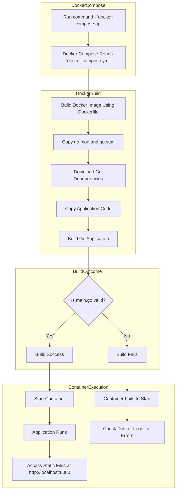

```mermaid
flowchart TD
    subgraph DockerCompose
        A[Run command - 'docker-compose up'] --> B[Docker Compose Reads 'docker-compose.yml']
    end

    subgraph DockerBuild
        B --> C[Build Docker Image Using Dockerfile]
        C --> D[Copy go.mod and go.sum]
        D --> E[Download Go Dependencies]
        E --> F[Copy Application Code]
        F --> G[Build Go Application]
    end

    subgraph BuildOutcome
        G --> H{Is main.go valid?}
        H -->|Yes| I[Build Success]
        H -->|No| J[Build Fails]
    end

    subgraph ContainerExecution
        I --> K[Start Container]
        J --> L[Container Fails to Start]
        K --> M[Application Runs]
        M --> N[Access Static Files at http://localhost:8080]
        L --> O[Check Docker Logs for Errors]
    end
```